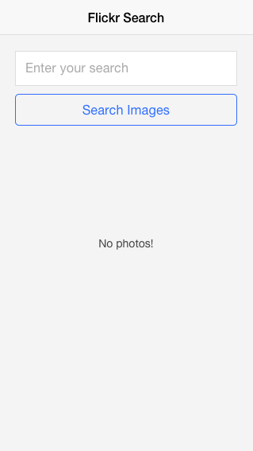

## Make a Mobile App Now with React and Reapp

React is enabling frontend developers to build apps like never before. It makes
them easier to reason about with it's one-way data binding and declarative interface,
and much faster the Virtual DOM.


Recently, [Reapp](http://reapp.io) was released. It's is a mobile
app platform that takes advantage of the performance and productivitiy benefits of
React to make building apps easier and more enjoyable than ever.

Reapp gives us a lot of cool things:

- A complete UI kit
  - Views, Buttons, Lists, Views, Forms, Modals, Popovers, Galleries...
- Custom themes
- Custom animations
- A CLI that:
  - Bootstraps an app in seconds
  - Includes everything: routing, requests, decorators and more
  - No-config Webpack builds (ES6 support!)
  - Builds to Cordova

Today, we're going to create an app using Reapp that pulls pictures from the Flickr API
and displays them in a photo gallery in no time at all.

### What we'll be building


http://gfycat.com/ifr/DistortedImpureAmericanwarmblood

### Starting out

With node installed, lets run `sudo install -g reapp` to install the Reapp CLI.
Once that installs, run `reapp new flickrapp`. Finally, `cd flickrapp` and `reapp run`.

You should see this:


Browse to [localhost:3010](http://localhost:3010) and you can see the default Reapp app:


**Tip: With Chrome's Developer Tools, [enable mobile device emulation](https://developer.chrome.com/devtools/docs/device-mode) to
view your app as a mobile app**


Alright! Now we're fully set up with a React stack using Reapp components. Lets check the file
structure:

```
/app
  components/
    home/
      Sub.jsx
    App.jsx
    Home.jsx
  app.js
  routes.js
/assets
```

Reapp scaffolded us some demonstration stuff here, which is what you see in `./app/components`.
The rest is just setting up our app. `./app/app.js` is the entry to our app, it loads Reapp
and runs our routes, which are found in `./app/routes.js`.

### Start Our View

We have our app generated, but Reapp generates us a full demo app showing nested views,
and we won't need much more than a single page. Lets simplify things. In `routes.js`
we can swap it out to just look like this:

```js
  module.exports = ({ routes, route }) =>
    routes(require,
      route('app', '/', { dir: '' })
    );
```

This wires up the base route (at [http://localhost:3010](http://localhost:3010)) to the name `app`,
which Reapp's router will automatically look for in `./components/App.jsx`.

Now we can delete the `Home.jsx` and `home/Sub.jsx` files, since we don't need multiple views.
You can leave them be as well if you'd like to explore using them later.

In the App.jsx file, we can simplify it to:

```js
import React from 'react';
import View from 'reapp-ui/views/View';

export default React.createClass({
  render() {
    var { photos } = this.state;

    return (
      <View title="Flickr Search" styles={{ inner: { padding: 20 } }}>
        <p>Hello World</p>
      </View>
    );
  }
});
```

If you refresh, you should see an empty view with your new title "Flickr Search" at top.


### Fetch Data from Flickr

Now we have an interface with no logic. Before we can link together the Button to the display
of photos, we need to grab the photos from Flickr using React conventions.
First, get yourself a Flickr account and API key using their quick [sign up form](https://www.flickr.com/services/apps/create/noncommercial/?).

After filling it out (and signing up if necessary) copy the Public Key they give you and add it as a constant to
App.jsx. You'll also need the URL that's used for searching for photos, which I found by using their [API explorer](https://www.flickr.com/services/api/explore/flickr.photos.search).
It should look like this:

```js
const key = '__YOUR_KEY_HERE__';
const base = 'https://api.flickr.com/services/rest/?api_key=${key}&format=rest&format=json&nojsoncallback=1';
```

Be sure to put your key instead of "__YOUR_KEY_HERE__".

*Note: `const` is a new feature in the next version of JavaScript, called ES6. It's just like
a variable, but one that can never be changed once it's set. How can we use this in our app now? Reapp has a [Webpack](webpack.github.io) build system built in
that gives you all sorts of features, including ES6 support!*

Next, define `getInitialState()` on our React class, so our component can track the photos
we'll be fetching. We add this as the first property after React.createClass.
Because we're storing photos in a list, add an array:

```js
getInitialState() {
  return {
    photos: []
  }
},
```

This will give us access to `this.state.photos` in our render function. In the UI we'll need a
Button and Input to use for searching:

```js
import Button from 'reapp-ui/components/Button';
import Input from 'reapp-ui/components/Input';
```

And then change the `render()` function:

```js
  render() {
    var { photos } = this.state;

    return (
      <View title="Flickr Search">
        <Input ref="search" />
        <Button onTap={this.handleSearch}>Search Images</Button>

        <div className="verticalCenter">
          {!photos.length &&
            <p>No photos!</p>
          }
        </div>
      </View>
    );
  }
```

And we get this:



Pretty easy! There's a few things to note here. First,  notice the [ref property](http://facebook.github.io/react/docs/more-about-refs.html)
on the Input? Ref is short for reference, and lets us track DOM elements in our class.
We'll use that in the future for getting the value of the field.

Also, note `className="verticalCenter"` on the div. Two things: Because we're using JSX
that compiles to JS objects ([more reading here](http://facebook.github.io/react/docs/jsx-in-depth.html)),
we can't use the normal `class` attribute, so instead use use
the JavaScript convention of `className` to set the class. The `verticalCenter` property is
given to us by Reapp, that will align things centered on our page.

Finally, the `onTap` property on Button? It's pointing to `this.handleSearch`.
But, we don't have any handleSearch function. React will expect that function defined on the
class, so lets wire it up. First, `npm install --save superagent` which gives us the excellent
[Superagent](https://github.com/visionmedia/superagent) request library. Then, import it:

```js
import Superagent from 'superagent';
```

Finally, define handleSearch:

```js
  handleSearch() {
    let searchText = this.refs.search.getDOMNode().value;
    Superagent
      .get(`${base}&method=flickr.photos.search&text=${searchText}&per_page=10&page=1`, res => {
        if (res.status === 200 && res.body.photos)
          this.setState({
            photos: res.body.photos.photo
          });
      });
  },
```

A few notes:

- `this.refs.search.getDOMNode()` returns the input DOM node that we put the "search" ref on earlier.
- `${base}` will grab the URL we put in the constant.
- `this.setState` will take our response photos and put them into the `this.state.photos` array
we defined earlier in `getInitialState`.


### Displaying Flickr Photos

Now we've fetched our Flickr photos and put them into the state. The last step is to display them.
You can add this to the first line of your render function to see what Flickr returns:

```js
render() {
  console.log(this.state.photos);
  // ... rest of render
}
```

In your console you'll see that Flickr returns an object with some properties. On [this helpful page](https://www.flickr.com/services/api/misc.urls.html)
I found out how to render the URL's for flickr.

Here's how I landed on constructing the URL for a photo, which I put as a simple function on the
class we're building:

```js
  getFlickrPhotoUrl(image) {
    return `https://farm${image.farm}.staticflickr.com/${image.server}/${image.id}_${image.secret}.jpg`;
  },
```

This function takes our Flickr object and turns them into the URL we need to display.
Next, lets edit the handleSearch `setState` call:

```js
  this.setState({
    photos: res.body.photos.photo.map(this.getFlickrPhotoUrl)
  });
```

The `map` function will loop over those photo objects and pass them to getFlickrPhotoUrl,
which returns our URL. We're all ready to display them!

Lets import the Gallery component from reapp and use it:

```js
import Gallery from 'reapp-ui/components/Gallery';
```

In the render function, below the `<p>No photos found!</p>` block:

```js
  {!!photos.length &&
    <Gallery
      images={photos}
      width={window.innerWidth}
      height={window.innerHeight - 44}
    />
  }
```

The Gallery widget takes these three properties and outputs fullscreen
images that you can swipe between. With this in place, we have completed
the flow of our app. Check out your browser and see it in action.

*Note: Why `window.innerHeigth - 44`?
We're adjusting for the TitleBar height in our app. There are better
ways we could do this, but for now this is simple and works well*

### Final touches

We're just about good, but there's a couple tweaks we can do. The gallery never lets
us close it as it is now. If we add an onClose property to gallery though, it will let us.
But, we'll also need to update the state to reflect the gallery being closed. It's actually
pretty easy. Just add this to Gallery:

```js
  onClose={() => this.setState({ photos: [] })}
```

Also, our Input looks a little plain as it is. Lets add a border, margin and placeholder:

```js
  <Input ref="search" placeholder="Enter your search" styles={{
    input: {
      margin: '0 0 10px 0',
      border: '1px solid #ddd'
    }
  }} />
```


Much better!

### Final code

As is, our entire codebase fits into the `./components/App.jsx` file. It's easy to read
and understand and uses some nice new features of ES6. Here it is:

```js
import React from 'react';
import View from 'reapp-ui/views/View';
import Button from 'reapp-ui/components/Button';
import Input from 'reapp-ui/components/Input';
import Superagent from 'superagent';
import Gallery from 'reapp-ui/components/Gallery';

const MY_KEY = '__YOUR_KEY_HERE__';
const base = `https://api.flickr.com/services/rest/?api_key=${MY_KEY}&format=rest&format=json&nojsoncallback=1`;

export default React.createClass({
  getInitialState() {
    return {
      photos: []
    }
  },

  // see: https://www.flickr.com/services/api/misc.urls.html
  getFlickrPhotoUrl(image) {
    return `https://farm${image.farm}.staticflickr.com/${image.server}/${image.id}_${image.secret}.jpg`;
  },

  handleSearch() {
    let searchText = this.refs.search.getDOMNode().value;
    Superagent
      .get(`${base}&method=flickr.photos.search&text=${searchText}&per_page=10&page=1`, res => {
        if (res.status === 200 && res.body.photos)
          this.setState({
            photos: res.body.photos.photo.map(this.getFlickrPhotoUrl)
          });
      });
  },

  render() {
    var { photos } = this.state;

    return (
      <View title="Flickr Search" styles={{ inner: { padding: 20 } }}>

        <Input ref="search" placeholder="Enter your search" styles={{
          input: {
            margin: '0 0 10px 0',
            border: '1px solid #ddd'
          }
        }} />
        <Button onTap={this.handleSearch}>Search Images</Button>

        <div className="verticalCenter">
          {!photos.length &&
            <p>No photos!</p>
          }

          {!!photos.length &&
            <Gallery
              onClose={() => this.setState({ photos: [] })}
              images={photos}
              width={window.innerWidth}
              height={window.innerHeight - 44}
            />
          }
        </div>

      </View>
    );
  }
});
```

### Next steps

We could keep going from here. We could display a list of images before,
and link them to the gallery. Reapp also has [docs on it's components](http://reapp.io/ui.html), so you can browse
and add them as you need. Good examples of Reapp code include the [Kitchen Sink demo](http://github.com/reapp/kitchen-sink)
and the [Hacker News App](http://github.com/reapp/hacker-news-app) they built.

### Check out the code

If you'd like to see our application you can [clone the repo we've put](https://github.com/reapp/demo-flickr).
It includes everything you need except a Flickr API key, which you'll want to sign
up for and insert before testing it out.

Steps to get the repo running:

1. Install [Node/npm](http://nodejs.org/), and Reapp: `sudo npm install -g reapp`
2. Clone the repo: `git clone git@github.com:reapp/flickr-demo`
3. Install dependencies: `npm install`
4. Start server: `reapp run`
5. View it in your browser at [http://localhost:3010](http://localhost:3010)

You'll probably want to explore the [Reapp getting started docs](http://reapp.io/start.html)
and the individual [UI widgets docs](http://reapp.io/ui.html) to keep you going.

Happy hacking!